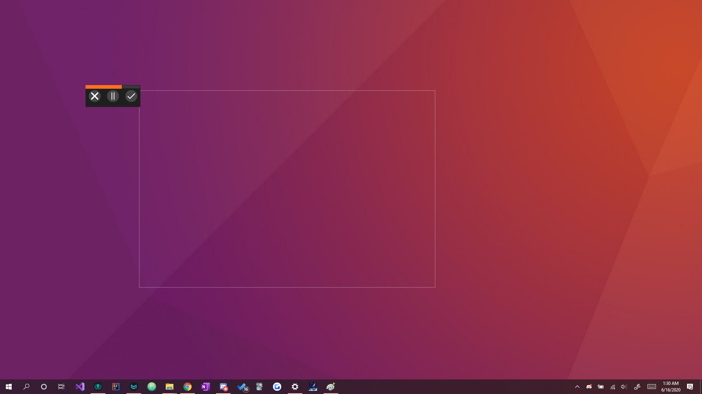

# ExoGif

This application is a basic screen-recording software created in C# with the assistance of AnimatedGIF and the WindowsCodeAPI-Shell & Core libaries. This program was made as a clone alternative to Gyazo however saves them purely locally.

## Prerequisites

The running of this program requires several libaries these include:

* AnimatedGif - 1.0.5
* System.Drawing.Common - 4.5.0
* WindowsAPICodePack-Core - 1.1.1
* WindowsAPICodePack-Shell - 1.1.1

## Authors

* **Shaan Khan** - *All Work*

## License

This project is licensed under the Mozilla Public License 2.0 - see the [LICENSE](https://github.com/ShaanCoding/ExoGif/blob/master/LICENSE) files for details
